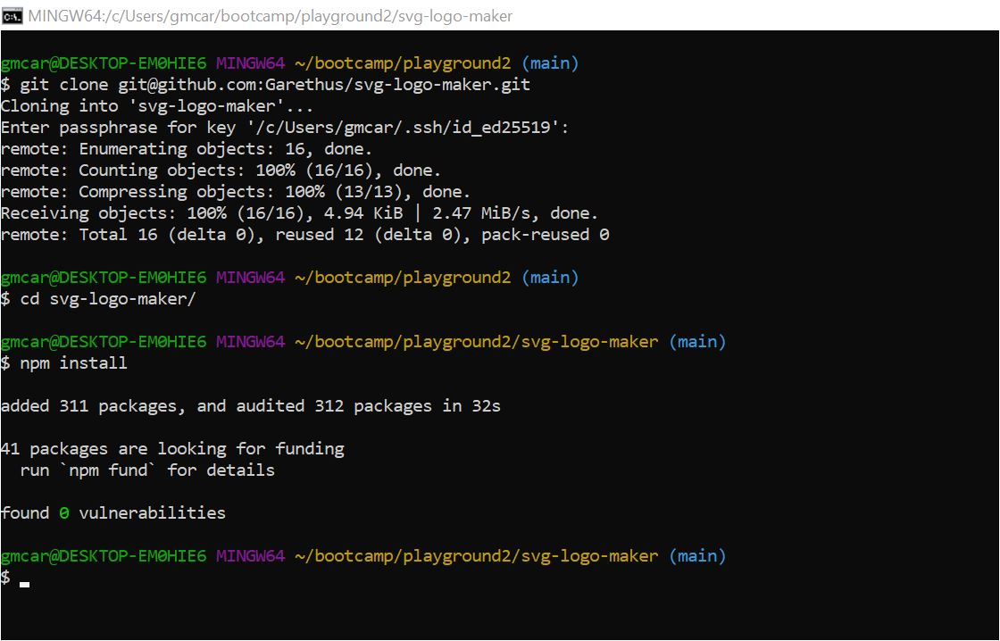
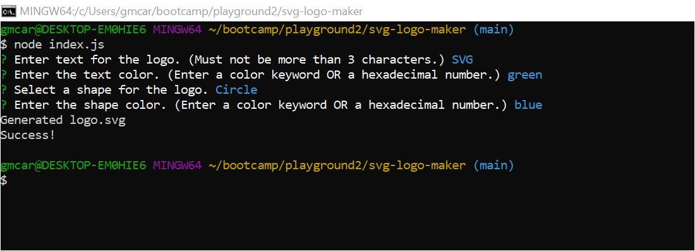
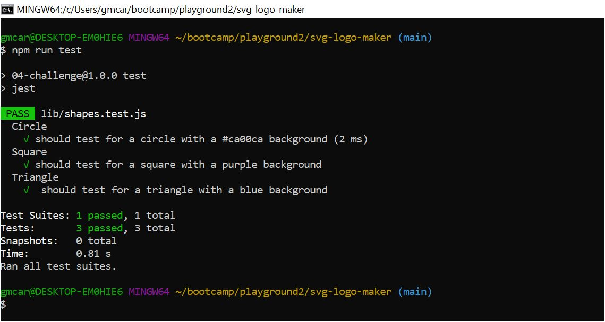

# README Generator

## Description

This is a command-line application that takes in user input to generate a logo and save it as an SVG file.

## Table of Contents

* [Walkthrough Video](#Walkthrough-Video)    
* [Installation](#Installation)  
* [Usage](#Usage)   
* [License](#License)  
* [Tests](#Tests)  
* [Questions](#Questions)

## Walkthrough-Video

Watch this [video](https://drive.google.com/file/d/1SE0zKLLPXqz_-dFQgsaYz3Vg3cFdU6cR/view?usp=sharing) demonstration to learn the functionality and how to use the application.

## Installation 

1. Clone the [repository](https://github.com/Garethus/readme-generator) of this project from Github into your local machine. 
2. Navigate to the project's directory. 
3. Then, run `npm install` to install the npm package dependencies. 

## Usage

The application will be invoked via GitBash. Make sure the directory points to where the package.json file of the application is. Then, run `node index.js`. You will be prompted in the command line with a series of questions about how you want your logo. The application will take your responses and generate your logo's SVG file. Genarated logo will be saved in the [images](./images/) folder.

## License

Licensed under the [MIT](./LICENSE) license.

## Contributing

If you want to help me make this application better, clone the repo, commit your changes and create a pull request. Thanks!

## Tests

To perform the test, run `npm run test`.

## Questions
    
If you have any questions about the project please contact me through my [GitHub](https://github.com/Garethus) or email me at reyes.grethelmaec@gmail.com.

